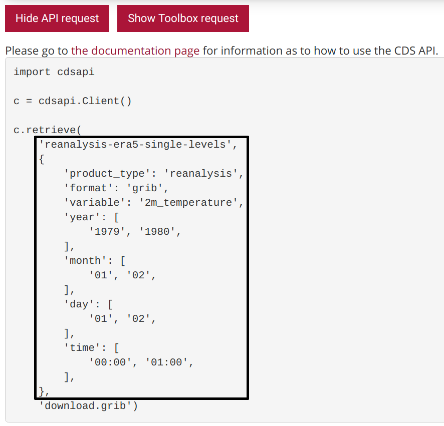

************
Introduction
************

The ado-downloader automates big data downloads from the Copernicus Climate Data
Store. Based on the `cdsapi <https://pypi.org/project/cdsapi/>`_ package, it
enables you, to automatically chunk big download requests into parallel processed
sub requests.

Configuration
=============

The downloader is based on the cdsapi and therefore also uses its authentication
method. In order to use the downloader, one has to create a file with user
credentials `api-how-to <https://cds.climate.copernicus.eu/api-how-to>`_ in the
home directory. Alternatively, define two environment variables 'CDSAPI\_URL'
and 'CDSAPI\_KEY' with the same user credentials. Either way, one needs a
`cds.climate.copernicus.eu <https://cds.climate.copernicus.eu/>`_ user account in
order to use the downloader.

Download
========

